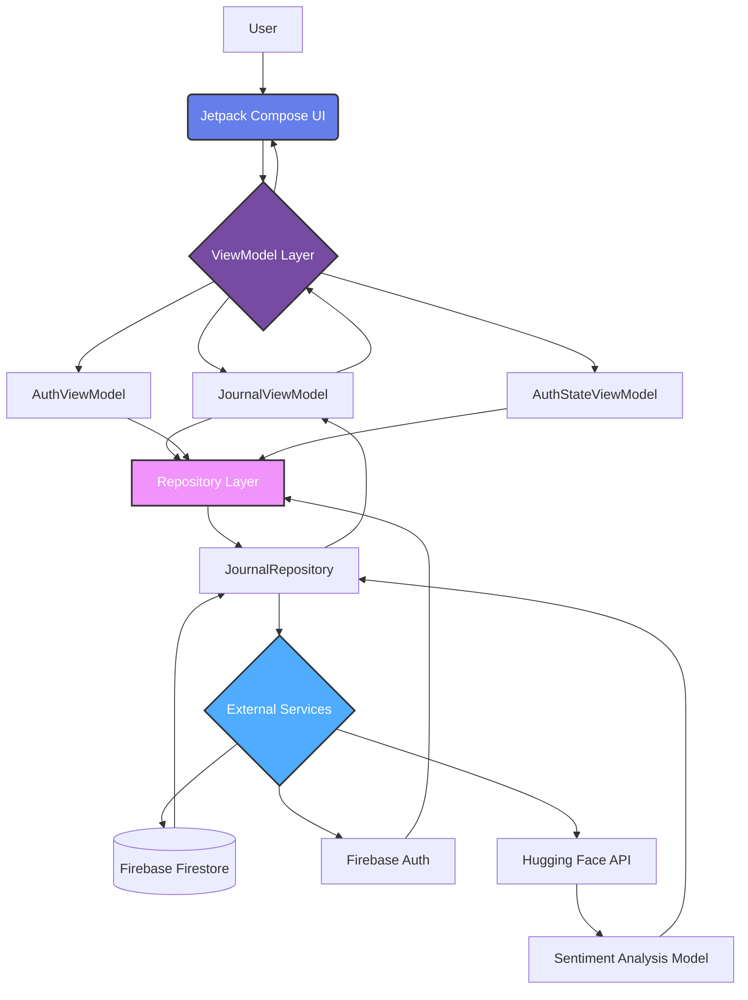
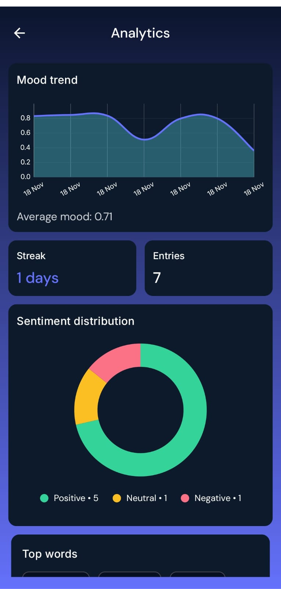
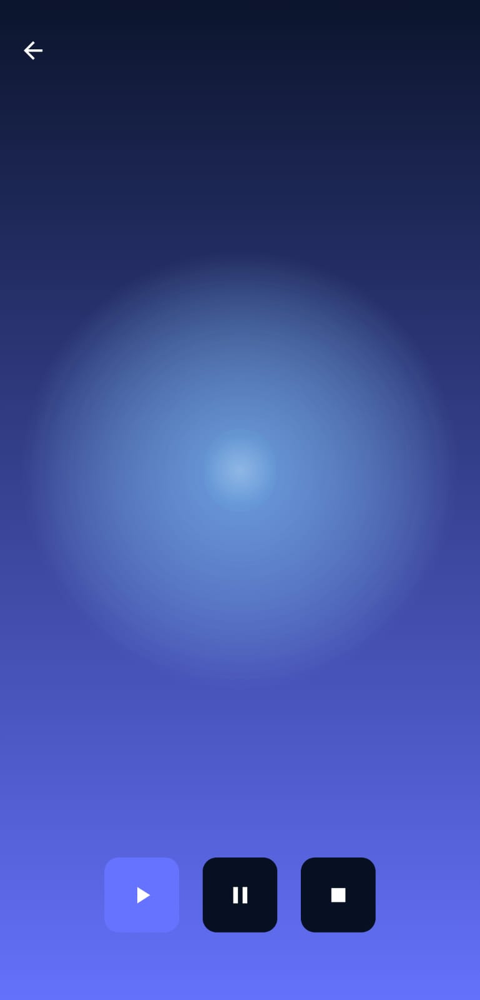

# AURA – AI-Based Emotional Wellness App 

<div align="center">


**An AI-powered emotional wellness companion built with modern Android technologies**

[](https://kotlinlang.org/)
[](https://developer.android.com/jetpack/compose)
[](https://firebase.google.com/)
[](https://huggingface.co/)

</div>

---

## 📖 Overview

**AURA** transforms traditional journaling into an intelligent emotional wellness experience. By combining sentiment analysis, mood tracking, and guided meditation, AURA helps users build healthier emotional habits while maintaining complete privacy.

Unlike conventional journaling apps that simply store text, AURA provides:

- 🧠 **AI-Powered Insights** - Real-time sentiment analysis using Hugging Face models
- 📊 **Mood Analytics** - Visual tracking of emotional patterns over time
- 🔒 **Privacy First** - All data isolated per user in secure Firebase storage
- 🎨 **Serene Design** - Calming gradients and intuitive Material3 UI
- 🧘 **Guided Meditation** - Integrated audio player for mindfulness

---

## ✨ Features

### 🔐 Authentication & Personalization
- Secure email/password authentication via Firebase Auth
- Persistent login sessions
- Personalized greeting with user's first name
- Seamless onboarding experience

### ✍️ Intelligent Journaling
- Write and save journal entries with rich text support
- Real-time AI sentiment analysis (Positive/Neutral/Negative)
- Confidence scores for each emotional assessment
- Automatic timestamping and cloud sync

### 📈 Mood Analytics Dashboard
- **Sparkline Charts** - Quick mood trend visualization on home screen
- **Line Charts** - Detailed sentiment tracking over time
- **Pie Charts** - Distribution of emotional states
- Powered by MPAndroidChart for smooth rendering

### 🎵 Meditation Center
- **Curated Soundscapes** - Professionally selected calming meditation tracks
- **Seamless Looping** - Continuous playback for uninterrupted mindfulness sessions
- **Immersive Full-Screen Mode** - Distraction-free meditation experience
- **Breathing Halo Animation** - Mesmerizing radial pulse effect synchronized with breathing rhythms
- **ExoPlayer Integration** - High-quality audio streaming with smooth playback
- **Gradient Ambience** - Soft, evolving background colors for visual tranquility
- **Minimalist Controls** - Intuitive play/pause without disrupting your flow

### 🗂️ Journal History
- Real-time synchronized journal list
- Sort by newest entries
- Swipe-to-delete with instant UI updates
- Firestore snapshot listeners for live data

---

## 🏗️ Architecture

AURA follows a **clean, layered MVVM architecture** with separation of concerns:



### Key Architectural Principles

- ✅ **Unidirectional Data Flow** - Clear, predictable state management
- ✅ **Single Source of Truth** - Repository pattern for data consistency
- ✅ **Separation of Concerns** - Each layer has distinct responsibilities
- ✅ **Reactive Programming** - StateFlow for reactive UI updates
- ✅ **Dependency Injection Ready** - Clean constructor injection pattern

---

## 🗄️ Data Structure

### Firestore Database Schema

```
users/
  └── {userId}/
      ├── profile
      │   └── firstName: "Rajath"
      └── journals/
          └── {journalId}/
              ├── id: "abc123"
              ├── text: "Today was amazing..."
              ├── sentiment: "Positive"
              ├── score: 0.98
              ├── timestamp: 1731938129381
              └── createdAt: ServerTimestamp
```

### Sentiment Analysis Model

**Model**: `cardiffnlp/twitter-roberta-base-sentiment`

**Output Mapping**:
- `LABEL_2` → Positive 😊
- `LABEL_1` → Neutral 😐
- `LABEL_0` → Negative 😔

**Fallback**: Lexicon-based sentiment analysis ensures app reliability if API fails

---

## 🛠️ Tech Stack

| Category | Technology |
|----------|-----------|
| **Language** | Kotlin |
| **UI Framework** | Jetpack Compose + Material3 |
| **Architecture** | MVVM + Repository Pattern |
| **Authentication** | Firebase Authentication |
| **Database** | Cloud Firestore |
| **ML/AI** | Hugging Face Inference API |
| **Networking** | Retrofit + OkHttp |
| **Charts** | MPAndroidChart |
| **Media Player** | ExoPlayer |
| **Async** | Kotlin Coroutines + Flow |
| **Dependency Injection** | Manual (DI-ready) |

---

## 📂 Project Structure

```
AURA/
├── app/
│   ├── src/main/java/com/Rajath/aura/
│   │   ├── ui/                          # Compose Screens
│   │   │   ├── HomeScreen.kt
│   │   │   ├── LoginScreen.kt
│   │   │   ├── JournalScreen.kt
│   │   │   ├── AnalyticsScreen.kt
│   │   │   └── MeditateScreen.kt
│   │   ├── vm/                          # ViewModels
│   │   │   ├── JournalViewModel.kt
│   │   │   ├── AuthViewModel.kt
│   │   │   └── AuthStateViewModel.kt
│   │   ├── data/                        # Models & Repositories
│   │   │   ├── JournalEntry.kt
│   │   │   └── JournalRepository.kt
│   │   └── network/                     # API Services
│   │       ├── HuggingFaceService.kt
│   │       └── RetrofitClient.kt
│   └── build.gradle.kts
├── .github/workflows/
│   └── android-build.yml                # CI/CD
└── README.md
```

---

## 🚀 Installation

### Prerequisites

- Android Studio Hedgehog or later
- JDK 17+
- Android SDK 34
- Firebase project with Authentication & Firestore enabled
- Hugging Face API token

### Setup Steps

1. **Clone the repository**
   ```bash
   git clone https://github.com/yourusername/AURA.git
   cd AURA
   ```

2. **Add Firebase Configuration**
   - Download `google-services.json` from Firebase Console
   - Place it in `app/` directory

3. **Configure API Keys**
   
   Create `local.properties` in root directory:
   ```properties
   HUGGING_FACE_API_KEY=your_api_key_here
   ```

4. **Setup Signing (for release builds)**
   
   Add to `local.properties`:
   ```properties
   AURA_STORE_FILE=path/to/keystore.jks
   AURA_KEY_ALIAS=your_key_alias
   AURA_KEY_PASS=your_key_password
   AURA_STORE_PASS=your_store_password
   ```

5. **Build the project**
   ```bash
   ./gradlew build
   ```

6. **Run on device/emulator**
   ```bash
   ./gradlew installDebug
   ```

---

## 🔧 Build Commands

### Debug Build
```bash
./gradlew assembleDebug
```

### Release APK
```bash
./gradlew assembleRelease
```

### Android App Bundle (Play Store)
```bash
./gradlew bundleRelease
```

---

## 🔒 Security

- 🔐 **Firebase Authentication** controls all access
- 🗄️ **Per-user data isolation** in Firestore
- 🔑 **API keys stored locally** (not in version control)
- 🚫 **No public Firestore rules** - all data private by default
- 📱 **Signed releases** with keystore protection

---

## 🎨 Design Philosophy

- **Calming Aesthetics** - Soft gradients and warm color palettes
- **Minimal Friction** - Intuitive navigation with bottom nav bar
- **Breathing Animations** - Subtle motion design for emotional comfort
- **Accessibility First** - High contrast ratios and readable typography
- **Typography** - DM Sans font family for modern, clean readability

---

## 🌟 Why AURA Stands Out

AURA demonstrates **production-ready Android development** with:

✨ Modern Android architecture patterns  
✨ Real-world ML API integration  
✨ Secure user authentication & data management  
✨ Real-time synchronization with Firestore  
✨ Compose-first UI with smooth animations  
✨ Clean state management using Flow & ViewModel  
✨ Professional software engineering practices

This is a **portfolio-quality project** showcasing expertise in UI design, backend integration, ML consumption, and scalable architecture.

---

## 📸 Screenshots

<div align="center">

| Home Screen | Journal Entry | Analytics | Meditation |
|-------------|---------------|-----------|-----------|
|  |  |  ||

</div>

---

## 🤝 Contributing

Contributions are welcome! Please feel free to submit a Pull Request.

1. Fork the project
2. Create your feature branch (`git checkout -b feature/AmazingFeature`)
3. Commit your changes (`git commit -m 'Add some AmazingFeature'`)
4. Push to the branch (`git push origin feature/AmazingFeature`)
5. Open a Pull Request

---

## 📄 License

This project is licensed under the MIT License - see the [LICENSE](LICENSE) file for details.

---

## 👨‍💻 Author

**Rajath**

- GitHub: [@RajathPatilKulkarni](https://github.com/RajathPatilKulkarni)
- Email: rajathpatilkulkarni@icloud.com

---

## 🙏 Acknowledgments

- [Hugging Face](https://huggingface.co/) for sentiment analysis models
- [Firebase](https://firebase.google.com/) for backend infrastructure
- [MPAndroidChart](https://github.com/PhilJay/MPAndroidChart) for beautiful charts
- [Jetpack Compose](https://developer.android.com/jetpack/compose) team for modern UI toolkit

---

<div align="center">

⭐ Star this repo if you find it helpful!

</div>
